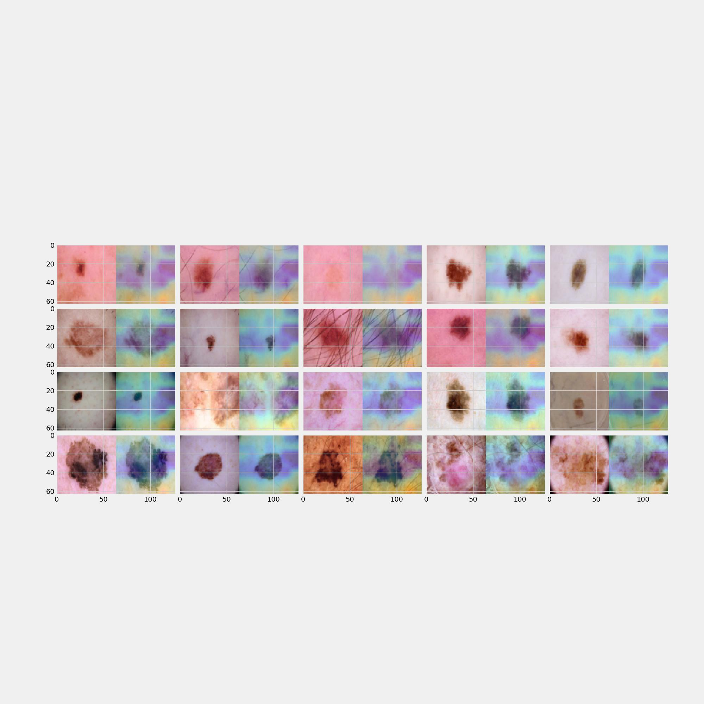

# XAI-with-fused-multi-class-Grad-CAM

<!-- TABLE OF CONTENTS -->

  
Table of Contents

  <ol>
    <li>
      <a href="#About">About</a>
    </li>
    <li>
      <a href="#Module">Module</a>
    </li>
    <li>
    <a href="#GradCam">Grad-CAM</a>
    </li>
  </ol>

<!-- ABOUT -->
## About

<!-- 
(<a href="#top">back to top</a>)
 -->

<!-- Module -->
## Module
The architecture of this work is as follows:

 * [data](/data) : englobes a class of data generator from a predefined folder of images and annotations (Car parts and damages dataset) which is then fed to a data loader. 
    * [__init__.py](/data/__init__.py)
    * [_base.py](/data/_base.py)

 * [eval](/eval) : eval the trainer model.
    * [__init__.py](/eval/__init__.py)
    * [_base.py](/eval/_base.py)

 * [fmgcam](/fmgcam) : extract the saliency maps.
    * [__init__.py](/fmgcam/__init__.py)
    * [_base.py](/fmgcam/_base.py)

 * [gradients](/gradients) : plot the distributions of gradients matrices in each channel for inspection reasons.

 * [outputs](/outputs) : contains some outputs such as the confusion matrix, the losses and the saliency maps.

 * [trainer](/trainer) : launchs trainings (you can add your model and import other models).
    * [__init__.py](/trainer/__init__.py)
    * [_base.py](/trainer/_base.py)

 * [utils](/utils) : contains some visualization utilities in particular for the saliency maps.
    * [_base.py](/utils/_base.py)

 * [weights](/weights) : contains the weights of the model.

 * [defs.py](/defs.py) 

 * [device.py](/device.py)

 * [README.md](/README.md)
  
 * [runner.py](/runner.py)

<!-- 
(<a href="#top">back to top</a>)
 -->

<!-- GradCam -->
## Grad-CAM

With a lightweight training of 5 epochs, the goal is to highlight the main pixels responsable for the final prediction for the following test images :

